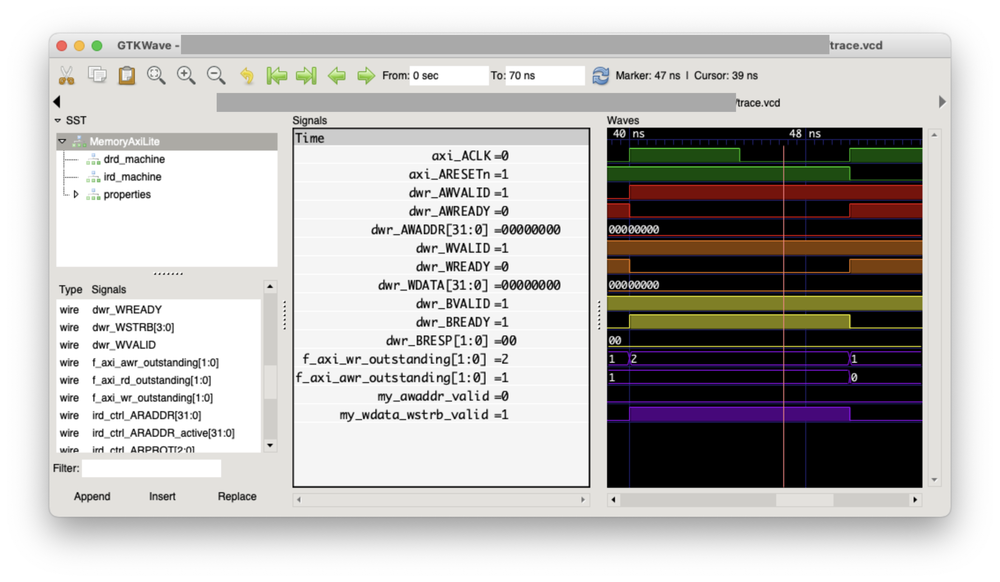

This repository contains the documentation and starter code for the homework assignments in [CIS 4710/5710: Computer Organization & Design](http://cis.upenn.edu/~cis5710/). Below we describe some of the important computing tools you'll need to use this semester.

# Docker

All of the software tools needed to compile, run and test your code are packaged into the `cis5710/hw-base:latest` Docker container which is [hosted on Docker Hub](https://hub.docker.com/r/cis5710/hw-base). You can install Docker on your computer, and then grab this container to get all of the tools at once. This is the same image that the Gradescope autograder uses as well.

First, install Docker for your OS. For Windows/Mac users, you'll probably want to use [Docker Desktop](https://www.docker.com/get-started/). Linux users may prefer to install via your regular package manager.

Then, you can pull the *container image*, which is the set of files that will be inside the running *container*. Pull the image via:
```
docker pull cis5710/hw-base:latest
```

And then run it to launch the *container*. This puts you inside an Ubuntu Linux command-line system with all of the tools installed. Launch the container with:
```
docker run -it cis5710/hw-base:latest /bin/bash
```

You should also configure Docker to [share a directory with your host machine](https://www.digitalocean.com/community/tutorials/how-to-share-data-between-the-docker-container-and-the-host) so that your files are saved when the container is terminated. We may need to make updates to the container image throughout the semester, so you will want to be able to restart your container (to obtain those updates) without losing your work.

If you'd like to install the tools locally instead, you can follow our [Dockerfile](docker/Dockerfile) for guidance.

# Git
  
We'll use git to distribute the code and instructions for the labs. Here's our recommended git setup so that you can have a private repo you can share with your group partner, and that also allows you to receive updates we make to [the `cis5710-homework` repo](https://github.com/cis5710/cis5710-homework), which we will also refer to as *upstream*. We'll use github in these instructions, but you can adapt these to other hosting situations as well.

### Setup an SSH key

Don't type in your password every time you push/pull from your repo. [Setup an SSH key on your github account](https://docs.github.com/en/github/authenticating-to-github/generating-a-new-ssh-key-and-adding-it-to-the-ssh-agent#generating-a-new-ssh-key) to enjoy security _and_ more usability!

### Setup your repo

First, one group member creates a new, empty private repo. **Do not initialize** the repo with a README, a `.gitignore` file, or a license.

Then, run the following commands on the command-line (e.g., on biglab or inside your Docker container). Substitute your GH username and the name of the repo you created for `YOURUSERNAME` and `YOURREPO`, respectively.

First, clone your empty repo (via SSH so that you use the SSH keys you setup previously):
```
git clone git@github.com:YOURUSERNAME/YOURREPO.git
cd YOURREPO
```
Then, add a connection called `upstream` to the upstream CIS 5710 repo and get the changes from `upstream`:
```
git remote add upstream https://github.com/cis5710/cis5710-homework.git
git fetch upstream
```
Now, merge those changes with the `main` branch in your repo:
```
git merge upstream/main
```
Then, push those changes back to your private Github repo:
```
git push
```
Finally, you must initialize the git submodules that this repo uses, with:
```
git submodule update --init --recursive riscv-tests/
```

> You may also have noticed the *solutions* submodule. This is a private repo so you'll get an error if you try to update it, either directly or by trying to update all submodules.

You now have a private repo that is linked with the upstream CIS 5710 repo. Next, [grant your group partner access](https://docs.github.com/en/github/setting-up-and-managing-your-github-user-account/inviting-collaborators-to-a-personal-repository) and then you're ready to go!

### Pulling changes from upstream

To get the latest changes from the upstream CIS 5710 repo, run:
```
git fetch upstream
git merge upstream/main
```
You shouldn't need to update submodules, as we don't anticipate those changing much.

# VSCode

While you can edit your code however you like, VSCode has decent support for SystemVerilog. I recommend the [Verilog-HDL/SystemVerilog/Bluespec SystemVerilog extension](https://marketplace.visualstudio.com/items?itemName=mshr-h.VerilogHDL) and the Python extension, as those are the languages you'll use most in this class. I also installed [verible](https://github.com/chipsalliance/verible) and enabled `verible-verilog-ls` for code navigation and `verible-verilog-format` for code formatting.

# GtkWave

While most of the tools we use run on the Linux command line, viewing waveforms is best done visually. Thus, you will want to install the GtkWave waveform viewer directly on your machine. In general, waveform files will be generated by running your design inside the container, and then you'll want to view those waveform files *outside* the container. Here's a screenshot of what GtkWave looks like:



### Linux

On Ubuntu:

```
sudo apt-get install gtkwave
```

You can then run `gtkwave SOMETHING.vcd &` to view the waveforms.

### Mac OSX

We recommend you use the [homebrew package manager](https://brew.sh):

```
brew cask install gtkwave
```

Note: If running a new version of homebrew, you may get the following error:
```
Error: `brew cask` is no longer a `brew` command. Use `brew <command> --cask` instead.
```
Change your command to the following: 
```
brew install gtkwave --cask
```

You can then launch `gtkwave`, and open the `.vcd` file with `File => Open New Window` or `File => Open New Tab`. Running `open SOMETHING.vcd` also opens gtkwave automatically, as does double-clicking the `.vcd` file in Finder.

### Windows

Download the Windows version of Gtkwave from [SourceForge](https://sourceforge.net/projects/gtkwave/files/): choose one of the win64 `.zip` files. After you unzip the archive, you can find `gtkwave.exe` inside its `bin` directory, and double-click to launch GtkWave from there. There is no need to install anything.

### General GtkWave tips

The list of signals in the bottom left shows only those for the currently-selected module instance in top-left box. There is also a `filter` box at the bottom you can use to quickly narrow down the list.

**Save your waveform view**

You can use `File => Write Save File` to save a `.gtkw` file that records the signals you have opened, along with radix and color. You can then reload this via `File => Read Save File` when viewing a new waveform to quickly pull up all the useful signals in an organized way.

**Use markers to remember important places**

With `Markers => Drop named marker` you can leave a mark at a particular time to make it easier to find again if you scroll away.
