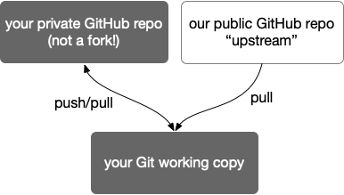

This repository contains the documentation and starter code for the homework assignments in [CIS 4710/5710: Computer Organization & Design](http://cis.upenn.edu/~cis5710/). Below we describe some of the important computing tools you'll need to use this semester.

# Git
  
We'll use git to distribute the code and instructions for the homeworks. Here's our recommended git setup so that you can have a private repo you can share with your group partner, and that also allows you to receive updates we make to [the `cis5710-homework` repo](https://github.com/cis5710/cis5710-homework), which we will also refer to as *upstream*. In these instructions, we'll use github and git terminal commands, but you can adapt these to other git hosting services or other git clients.

> **Do not fork this repo** on GitHub unless you are submitting a Pull Request to fix something here. For doing your homework, you should start from a new private GitHub repo instead.

Once you are done setting things up, your repo will have this structure:



### Setup an SSH key

Don't type in your password every time you push/pull from your repo. [Setup an SSH key on your github account](https://docs.github.com/en/github/authenticating-to-github/generating-a-new-ssh-key-and-adding-it-to-the-ssh-agent#generating-a-new-ssh-key) to enjoy security _and_ more usability!

### Setup your repo

First, one group member creates a new, empty private repo. **Do not initialize** the repo with a README, a `.gitignore` file, or a license.

Then, run the following commands on the command-line on your laptop. Substitute your GH username and the name of the repo you created for `YOURUSERNAME` and `YOURREPO`, respectively.

First, clone your empty repo (via SSH so that you use the SSH keys you setup previously):
```
git clone git@github.com:YOURUSERNAME/YOURREPO.git
cd YOURREPO
```
Then, add a connection called `upstream` to the upstream CIS 5710 repo and get the changes from `upstream`:
```
git remote add upstream https://github.com/cis5710/cis5710-homework.git
git fetch upstream
```
Now, merge those changes with the `main` branch in your repo:
```
git merge upstream/main
```
Then, push those changes back to your private Github repo:
```
git push
```
Finally, you must initialize the git submodules that this repo uses, with:
```
git submodule update --init --recursive riscv-tests/
```

> You may also have noticed the *solutions* submodule. This is a private repo so you'll get an error if you try to update it, either directly or by trying to update all submodules.

You now have a private repo that is linked with the upstream CIS 5710 repo. Next, [grant your group partner access](https://docs.github.com/en/github/setting-up-and-managing-your-github-user-account/inviting-collaborators-to-a-personal-repository) and then you're ready to go!

### Pulling changes from upstream

To get the latest changes from the upstream CIS 5710 repo, run:
```
git fetch upstream
git merge upstream/main
```

You can pull in submodule changes via `git submodule update --recursive riscv-tests/`.


# Docker

All of the software tools needed to run and test your code are packaged into the `cis5710/hw-base:latest` Docker container which is [hosted on Docker Hub](https://hub.docker.com/r/cis5710/hw-base). You can install Docker on your computer, and then grab this container to get all of the tools at once. This is the same image that the Gradescope autograder uses, so you should see the same results in Docker as you see with the autograder.

First, install Docker for your OS. For Windows/Mac users, you'll probably want to use [Docker Desktop](https://www.docker.com/get-started/). Linux users may prefer to install via your regular package manager.

Then, you can pull the *container image*, which is the set of files that will be inside the running *container*. Pull the image via:
```
docker pull cis5710/hw-base:latest
```

The next step will be to launch a *container*, which is like a lighter-weight version of a virtual machine. Our container is an Ubuntu Linux command-line system.

First, you should pick the *name* of your container (change it from `MY-CIS5710` in the `docker run` command below), which will make it easy to start, stop and distinguish from other containers you may be running.

The container has its own filesystem, separate from the files on your laptop. However, you can select a directory that you want to share between your laptop and the container. **Files outside of this shared directory do not persist if the container is restarted.** You may need to restart the container if you need to reboot your laptop or if we update the container image during the semester. So your cloned git repo should live on your laptop, not solely inside the container. In the `docker run` command below, replace `/PATH/ON/YOUR/LAPTOP` with the path to the laptop directory where you cloned your private github repo. This directory will appear inside the container at `/MYSTUFF`

After editing this command appropriately, launch the container for the first time:
```
docker run --name MY-CIS5710 --interactive --tty --mount type=bind,source="/PATH/ON/YOUR/LAPTOP",target=/MYSTUFF cis5710/hw-base:latest /bin/bash
```

Once you've launched the container, you can keep it running in the background. If you want to free up more resources, however, you can **stop** your container with this command (substituting the name you gave your container previously):

```
docker stop MY-CIS5710
```

Stopping your container will end your shell session, but not lose any of the files inside the container. You can then start the container again and launch a new shell with:

```
docker start MY-CIS5710
docker exec -it MY-CIS5710 /bin/bash
```

It is also possible to install the various tools you need for this course directly on your laptop, which avoids the need for Docker. You can follow our [Dockerfile](docker/Dockerfile) for guidance.

# VSCode

We've found that VSCode has decent support for SystemVerilog. I recommend the [Verilog-HDL/SystemVerilog/Bluespec SystemVerilog extension](https://marketplace.visualstudio.com/items?itemName=mshr-h.VerilogHDL) and the Python extension, as those are the languages you'll use most in this class. I also installed [verible](https://github.com/chipsalliance/verible) and enabled `verible-verilog-ls` for code navigation and `verible-verilog-format` for code formatting.

# Waveform Viewer

While most of the tools we use run on the Linux command line, viewing waveforms is best done in a graphical environment. Thus, you will want to install the a waveform viewer directly on your laptop. In general, waveform files will be generated by running your design inside the container, and then you'll want to view those waveform files *outside* the container. GtkWave is a popular waveform viewer, which looks like this:


### Ubuntu Linux


```
sudo apt-get install gtkwave
```

You can then run `gtkwave SOMETHING.vcd &` to view the waveforms.

### Mac OSX

We recommend you use the [homebrew package manager](https://brew.sh), and then run:

```
brew install gtkwave --cask
```

You can then launch `gtkwave`, and open the `.vcd` file with `File => Open New Window` or `File => Open New Tab`. Running `open SOMETHING.vcd` also opens gtkwave automatically, as does double-clicking the `.vcd` file in Finder.

In some versions of MacOS, `gtkwave` cannot be installed, but `surfer` is a nice alternative. Install it with:

```
brew install surfer
```

### Windows

Download the Windows version of Gtkwave from [SourceForge](https://sourceforge.net/projects/gtkwave/files/): choose one of the win64 `.zip` files. After you unzip the archive, you can find `gtkwave.exe` inside its `bin` directory, and double-click to launch GtkWave from there. There is no need to install anything.

### General GtkWave tips

The list of signals in the bottom left shows only those for the currently-selected module instance in top-left box. There is also a `filter` box at the bottom you can use to quickly narrow down the list.

**Save your waveform view**

You can use `File => Write Save File` to save a `.gtkw` file that records the signals you have opened, along with radix and color. You can then reload this via `File => Read Save File` when viewing a new waveform to quickly pull up all the useful signals in an organized way.

**Use markers to remember important places**

With `Markers => Drop named marker` you can leave a mark at a particular time to make it easier to find again after you scroll away. This is especially helpful in long traces.
