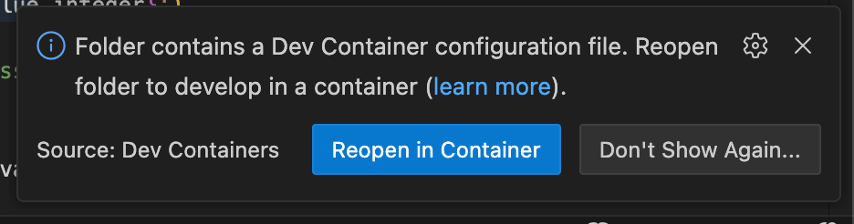

This repository contains the documentation and starter code for the homework assignments in [CIS 4710/5710: Computer Organization & Design](http://cis.upenn.edu/~cis5710/). Below we describe some of the important computing tools you'll need to use this semester.

# Git
  
We'll use git to distribute the code and instructions for the homeworks. Here's our recommended git setup so that you can have a private repo you can share with your group partner, and that also allows you to receive updates we make to [the `cis5710-homework` repo](https://github.com/cis5710/cis5710-homework), which we will also refer to as *upstream*. In these instructions, we'll use github and git terminal commands, but you can adapt these to other git hosting services or other git clients.

> **Do not fork this repo** on GitHub unless you are submitting a Pull Request to fix something here. For doing your homework, you should start from a new private GitHub repo instead.

Once you are done setting things up, your repo will have this structure:


### Setup an SSH key

Don't type in your password every time you push/pull from your repo. [Setup an SSH key on your github account](https://docs.github.com/en/github/authenticating-to-github/generating-a-new-ssh-key-and-adding-it-to-the-ssh-agent#generating-a-new-ssh-key) to enjoy security _and_ more usability!

### Setup your repo

First, one group member creates a new, empty private repo. **Do not initialize** the repo with a README, a `.gitignore` file, or a license.

Then, run the following commands on the command-line on your laptop. Substitute your GH username and the name of the repo you created for `YOURUSERNAME` and `YOURREPO`, respectively.

First, clone your empty repo (via SSH so that you use the SSH keys you setup previously):
```
git clone git@github.com:YOURUSERNAME/YOURREPO.git
cd YOURREPO
```
Then, add a connection called `upstream` to the upstream CIS 5710 repo and get the changes from `upstream`:
```
git remote add upstream https://github.com/cis5710/cis5710-homework.git
git fetch upstream
```
Now, merge those changes with the `main` branch in your repo:
```
git merge upstream/main
```
Then, push those changes back to your private Github repo:
```
git push
```
Finally, you must initialize the git submodules that this repo uses, with:
```
git submodule update --init --recursive riscv-tests/
```

> You may also have noticed the *solutions* submodule. This is a private repo so you'll get an error if you try to update it, either directly or by trying to update all submodules.

You now have a private repo that is linked with the upstream CIS 5710 repo. Next, [grant your group partner access](https://docs.github.com/en/github/setting-up-and-managing-your-github-user-account/inviting-collaborators-to-a-personal-repository) and then you're ready to go!

### Pulling changes from upstream

To get the latest changes from the upstream CIS 5710 repo, run:
```
git fetch upstream
git merge upstream/main
```

You can pull in submodule changes via `git submodule update --recursive riscv-tests/`.


# Development Environment

The recommended way to work on your code is to use Visual Studio Code with the Dev Container we provide. The Dev Container automatically sets up VS Code with some useful extensions for working with System Verilog, and connects you to a Linux Docker container which has both your homework files and the required hardware simulators and compilers pre-installed.

The first step is to visit the [VS Code Dev Containers tutorial](https://code.visualstudio.com/docs/devcontainers/tutorial). Follow the first part of the tutorial to:

1) install VS Code
2) install Docker
3) install the Dev Containers extension for VS Code

After [installing the Dev Containers extension](https://code.visualstudio.com/docs/devcontainers/tutorial#_install-the-extension), stop following the tutorial.

Open the folder that is the `cis5710-homework` repository you created and cloned above. A pop-up will appear in VS Code: click `Reopen in Container` (see below). This downloads the container image and launches the container. Inside the container, you can access all of the files in your `cis5710-homework` folder, and also run the homework tools via the VS Code terminal.



For reference, our Docker image is [hosted on Docker Hub](https://hub.docker.com/r/cis5710/hw-base-gradescope). This is the same image that the Gradescope autograder uses, so you should see the same results in Docker as you see with the autograder.

### Apple Silicon

The `hw-base-gradescope` image is an x86 (Intel/AMD) image. If you are running on Apple Silicon, there is some overhead from translating x86 instructions to ARM instructions on-the-fly. You may want to switch to our ARM container image instead, though it is in "beta" status and not as well-tested as the x86 container. Please do let us know about your experience using it, however, so we can improve it.

To switch, simply edit the [`.devcontainer.json`](.devcontainer.json) file to reference the `cis5710/hw-base-arm:latest` image instead of the `cis5710/hw-base-gradescope:latest` image. When you re-open VS Code, it should ask you if you want to switch to the new image.

It is also possible to install the various tools you need for this course directly on your laptop. You can follow our [Dockerfile](docker/Dockerfile.gradescope) for guidance.

### VS Code notes

We've found that VS Code has decent support for SystemVerilog. I like the [Verilog-HDL/SystemVerilog/Bluespec SystemVerilog extension](https://marketplace.visualstudio.com/items?itemName=mshr-h.VerilogHDL), the [VaporView waveform viewer](https://marketplace.visualstudio.com/items?itemName=lramseyer.vaporview) and the Python extension, as those are languages/tools you'll use a lot in this class. These are all installed in your Dev Container by default.

I also installed [verible](https://github.com/chipsalliance/verible) and enabled `verible-verilog-ls` for code navigation and `verible-verilog-format` for code formatting.

# Waveform Viewer

While most of the tools we use run on the Linux command line, viewing waveforms is best done in a graphical environment. Our Dev Container includes the VaporView extension, which allows you to view waveforms directly in VS Code.

While Dev Containers hide the details, it's good to know that waveform files will be generated by running your design inside the container, and then you'll want to view those waveform files *outside* the container. There are many waveform viewers you can use outside of VS Code as well. GtkWave is an old but popular choice, which looks like this:


### Ubuntu Linux


```
sudo apt-get install gtkwave
```

You can then run `gtkwave SOMETHING.vcd &` to view the waveforms.

### Mac OSX

We recommend you use the [homebrew package manager](https://brew.sh), and then run:

```
brew install gtkwave --cask
```

You can then launch `gtkwave`, and open the `.vcd` file with `File => Open New Window` or `File => Open New Tab`. Running `open SOMETHING.vcd` also opens gtkwave automatically, as does double-clicking the `.vcd` file in Finder.

In some versions of MacOS, `gtkwave` cannot be installed, but `surfer` is a nice alternative. Install it with:

```
brew install surfer
```

### Windows

Download the Windows version of Gtkwave from [SourceForge](https://sourceforge.net/projects/gtkwave/files/): choose one of the win64 `.zip` files. After you unzip the archive, you can find `gtkwave.exe` inside its `bin` directory, and double-click to launch GtkWave from there. There is no need to install anything.

### Waveform viewing tips

**Use formatting options**

With lots of signals on the screen, they can start to blend together. Assign different signals different colors, and group related signals by color.

**Search, don't scroll**

The list of signals in your design can become quite long. Use search features to quickly locate the signal you're looking for.

In GtkWave, the list of signals in the bottom left shows only those for the currently-selected module instance in top-left box. There is also a `filter` box at the bottom you can use to quickly narrow down the list.

**Save your waveform view**

Most waveform viewers can save your current view (the signals you were viewing and their colors, formatting, etc.) to make it easy to load up again later. This can save a huge amount of time compared to adding your signals again from scratch.

In GtkWave, you can use `File => Write Save File` to save a `.gtkw` file that records the signals you have opened, along with radix and color. You can then reload this via `File => Read Save File` when viewing a new waveform to quickly pull up all the useful signals in an organized way.

**Use markers to remember important places**

In GtkWave, with `Markers => Drop named marker` you can leave a mark at a particular time to make it easier to find again after you scroll away. This is especially helpful in long traces.

**Make yourself at home**

As you debug your design, you will spend a significant amount of time looking at waveforms to understand what your design is doing. It is worth exploring the features of your waveform viewer to become proficient with finding the signals you need, moving throughout the timeline and organizing signals in a useful way.
