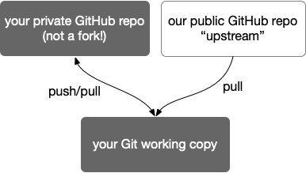
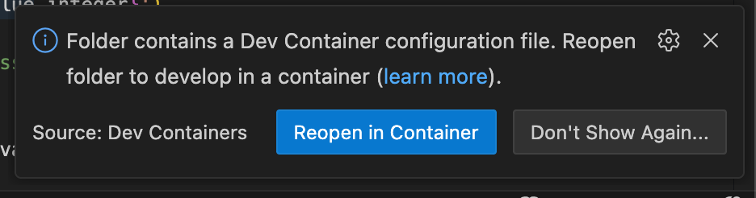
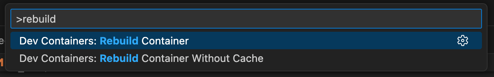

This repository contains the documentation and starter code for the homework assignments in [CIS 4710/5710: Computer Organization & Design](http://cis.upenn.edu/~cis5710/).

# Git
  
We'll use git to distribute the code and instructions for the homeworks. Here's our recommended git setup so that you can have a private repo where you can commit your code, that also allows you to receive updates we make to [the `cis5710-homework` repo](https://github.com/cis5710/cis5710-homework), which we will also refer to as *upstream*. In these instructions, we'll use github and git terminal commands, but you can adapt these to other git hosting services or other git clients.

> **Do not fork this repo** on GitHub unless you are submitting a Pull Request to fix something here. For doing your homework, you should start from a new private GitHub repo instead.

Once you are done setting things up, your repo will have this structure:



### Setup an SSH key

Don't type in your password every time you push/pull from your repo. [Setup an SSH key on your github account](https://docs.github.com/en/github/authenticating-to-github/generating-a-new-ssh-key-and-adding-it-to-the-ssh-agent#generating-a-new-ssh-key) to enjoy security _and_ more usability!

### Setup your repo

First, create a new, empty private repo. **Do not initialize** the repo with a README, a `.gitignore` file, or a license.

Then, run the following commands on the command-line on your laptop. Substitute your GH username and the name of the repo you created for `YOURUSERNAME` and `YOURREPO`, respectively.

First, clone your empty repo (via SSH so that you use the SSH keys you setup previously):
```
git clone git@github.com:YOURUSERNAME/YOURREPO.git
cd YOURREPO
```
Then, add a connection called `upstream` to the upstream CIS 5710 repo and get the changes from `upstream`:
```
git remote add upstream https://github.com/cis5710/cis5710-homework.git
git fetch upstream
```
Now, merge those changes with the `gem5` branch in your repo:
```
git merge upstream/gem5
```
Then, push those changes back to your private Github repo:
```
git push
```

You now have a private repo that is linked with the upstream CIS 5710 repo. You're ready to go!

### Pulling changes from upstream

To get the latest changes from the upstream CIS 5710 repo, run:
```
git fetch upstream
git merge upstream/gem5
```


# Development Environment

The recommended way to work on your code is to use Visual Studio Code with the Dev Container we provide. The Dev Container automatically sets up VS Code and connects you to a Linux Docker container which has both your homework files and gem5 pre-installed.

The first step is to visit the [VS Code Dev Containers tutorial](https://code.visualstudio.com/docs/devcontainers/tutorial). Follow the first part of the tutorial to:

1) install VS Code
2) install Docker
3) install the Dev Containers extension for VS Code

After [installing the Dev Containers extension](https://code.visualstudio.com/docs/devcontainers/tutorial#_install-the-extension), stop following the tutorial.

Open the folder that is the `cis5710-homework` repository you created and cloned above. A pop-up will appear in VS Code: click `Reopen in Container` (see below). This downloads the container image and launches the container. Inside the container, you can access all of the files in your `cis5710-homework` folder, and also run the homework tools via the VS Code terminal.



For reference, our Docker image is [hosted on Docker Hub](https://hub.docker.com/r/cis5710). This is the same image that the Gradescope autograder uses, so you should see the same results in Docker as you see with the autograder.

### Updating your Dev Container

Occasionally, we may need to ship an update to the Dev Container image. You will pull the updated [`.devcontainer.json`](.devcontainer.json) file from our `upstream` GitHub repo, and then need to rebuild your Dev Container. With the Dev Container running in VS Code, open the Command Palette (`Ctrl+Shift+P` on Windows/Linux, `Cmd+Shift+P` on Mac), type `Rebuild` and select the `Dev Containers: Rebuild Container` option (see screenshot below). This will fetch the new image and re-launch your container.




### Running Docker directly

Sometimes VS Code Dev Containers can be difficult to set up, or you may prefer to run the container directly to work with a different code editor. You can run our container directly instead of via VS Code. There is a lot of documentation on the web about how to use Docker but we offer a brief tutorial for the Docker command-line interface. Briefly, a Docker *container* is like a "virtual computer" running on your laptop, which has its own operating system and files, separate from those on your laptop. A *container image* is the initial "virtual hard drive" state for that virtual computer. You can't run an image directly, but instead run a container using an image.

First, find the latest *version* of our container image [on DockerHub](https://hub.docker.com/u/cis5710) or in the [`.devcontainer.json`](.devcontainer.json) file. In all the commands below, replace `TODO-VERSION` with that latest version you found. This first command downloads the container image to your laptop:

```
docker pull cis5710/gem5-hw-base-gradescope:TODO-VERSION

```

Then, you should pick the *name* of your container (you can change it from `MY-CIS5710` in the `docker run` command below), which will make it easy to start, stop and distinguish from other containers you may be running.

The container has its own filesystem, separate from the files on your laptop. However, you can select a directory that you want to share between your laptop and the container. **Files outside of this shared directory do not persist if the container is restarted.** You may need to restart the container if you need to reboot your laptop or if we update the container image during the semester. So your cloned git repo should live on your laptop, not solely inside the container. In the `docker run` command below, replace `/PATH/ON/YOUR/LAPTOP` with the path to the laptop directory where you cloned your private GitHub repo. This directory will appear inside the container at `/MYSTUFF`

After editing this command appropriately, launch the container for the first time:
```
docker run --name MY-CIS5710 --interactive --tty --mount type=bind,source="/PATH/ON/YOUR/LAPTOP",target=/MYSTUFF cis5710/gem5-hw-base-gradescope:TODO-VERSION /bin/bash
```

The Docker app offers a nice graphical interface to start/stop/delete containers and images. We discuss how to perform these common operations on the command-line below.

Once you've launched the container, you can keep it running in the background. If you want to free up more resources, however, you can **stop** your container with this command (substituting the name you gave your container previously):

```
docker stop MY-CIS5710
```

Stopping your container will end your shell session, but not lose any of the files inside the container - it's like "powering off" the container "virtual computer". You can then start the container again and launch a new shell with:

```
docker start MY-CIS5710
docker exec -it MY-CIS5710 /bin/bash
```

You can also *delete* the container to free up all its resources, which is like discarding the container "virtual computer" and all of its files:

```
docker rm MY-CIS5710
```
