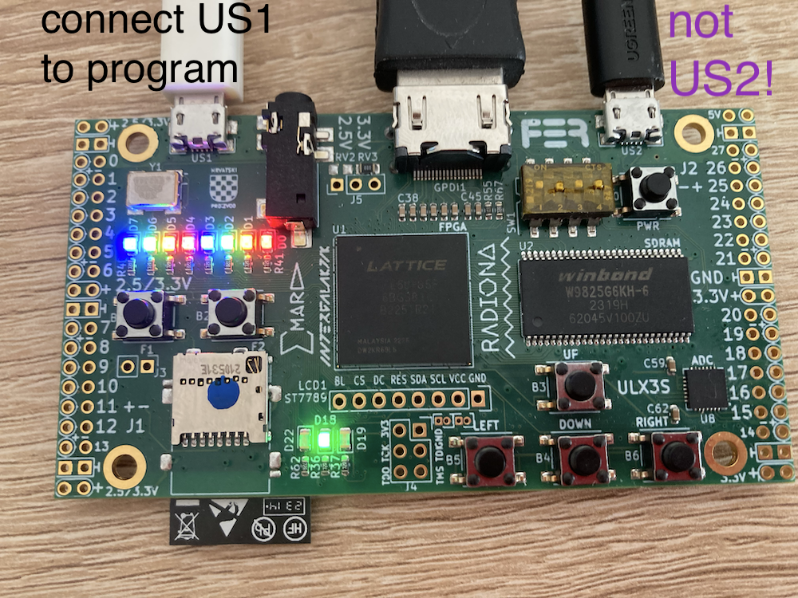

You'll implement a two-level Carry-LookAhead (CLA) adder, as discussed in class. This adder will then be used in your processor implementation in a later homework.

## gp4 schematic

Draw a detailed schematic (by hand or computerized) of your hardware design for the `gp4` CLA module. You don't need to draw a CLA schematic or one for `gp8`; those are similar to the lecture slides and to `gp4`, respectively.

You should include signal names, module names, port names and bus widths. You can leave a module as a black box to simplify things, but then you should show elsewhere on the schematic what that black box does.

Simple modules (e.g., muxes and the SystemVerilog operators you are allowed to use) can be drawn as in the lecture slides or as a simple box with a label. They don't need further elaboration.

See also [the example schematic for Lab 1](../hw1-systemverilog/hw1-schematic.pdf).

When your schematic is complete, you can translate it directly into SystemVerilog. We encourage you to keep your schematic up-to-date as your design evolves.


## gp4/gp8 modules

We supply some skeleton code in `cla.sv`, including module port definitions and the simple `gp1` generate-propagate module at the leaf of the CLA hierarchy. You will need to implement three additional modules to have a complete 32-bit adder.

You should start with the `gp4` module, which computes aggregate g/p signals for a 4-bit slice of the addition. The module takes the bit-level g/p signals from `gp1` as input, and computes whether all 4 bits collectively generate/propagate a carry. The module also computes the actual carry-out values for the low-order 3b of its input. You should also think about why `gp4` doesn't compute 4b worth of carry-out 😉. The `gp4` module will form the top layer of your CLA hierarchy. Our `gp4` solution is about 30 lines of code.

SystemVerilog's reduction operators will come in handy in building your `gp4` module. They perform a bit-wise reduction like so:
```
wire [3:0] w;
wire or_reduction;
assign or_reduction = (| w);
assign or_reduction = (w[3] | w[2] | w[1] | w[0]); // equivalent to code above
```
Reductions can be combined with indexing to reduce just a portion of a bus:
```
wire [3:0] w;
wire or_reduction;
assign or_reduction = (| w[2:0]);
assign or_reduction = (w[2] | w[1] | w[0]); // equivalent to code above
```

You can run `gp4` tests via `MAKEFLAGS=-j4 pytest --exitfirst --capture=no testbench.py -k runCocotbTestsGp4`, though their coverage is low so we encourage you to add other test cases as well.

Once you have the `gp4` module working, you can move on to the `gp8` module which will form the base of your CLA hierarchy. The `gp8` logic is a generalization of `gp4` to a larger window size. Though it is harder, you may consider implementing a parameterized `gpn` module that computes generate/propagate/carry-out over an N-bit window. You can then instantiate this appropriately for both `gp4` and `gp8`.

## cla module

Finally, you will build the 32-bit adder module `cla`. Use the `gp1`, `gp4` and `gp8` modules to build your CLA tree and to compute the final sum. Our `cla` solution is about 30 lines of code.

You can test your `cla` module via `MAKEFLAGS=-j4 pytest --exitfirst --capture=no testbench.py -k runCocotbTestsCla`.

The autograder will run both the CLA and gp4 tests. You can do this yourself via the command `MAKEFLAGS=-j4 pytest --exitfirst --capture=no testbench.py`

## Submitting your code

Submit your `cla.sv` file on Gradescope.

## FPGA Demo

Now that your code works in simulation, you can run the FPGA board demo to see it run in real life!

The demo code is in the `system/System.sv` module, and it uses your adder to add 26 to a 5-digit binary number represented by four of the board's buttons (B1, B2, B5, B4, B6). When a button is not pressed, it represents a 0; pressing it changes that bit to a 1 instead. The resulting sum is displayed on LEDs.


### Generating a bitstream

Inside the Docker container, run the command `make demo`. This will generate a *bitstream* file by running *synthesis* and then *place-and-route*, mapping your design onto the FPGA's hardware.

When this completes, you will have your bitstream file in `fpga_build/SystemDemo.bit`.

### Programming the FPGA

Since we are programming the FPGA outside of the container, this step is dependent on the host computer platform you use.

### Windows

We use `fujprog` to program our lattice FPGA, the official github page of `fujprog` is [here](https://github.com/kost/fujprog). 

First, go to the official repo and click the release section, select the `fujprog-v48-win64.exe` and download it.
Then rename it to `fujprog.exe` and move it under your homework directory path.
You can use `./fujprog -h` command to see if `fujprog` is properly working.

Secondly, connect the FPGA to your PC through the `us1` micro-USB connector on the board. See the picture below.

Run `./fujprog -i` to see if your pc can detect any port. 
If not, it means that you probably need to install some drivers.
Go [here](https://ftdichip.com/drivers/d2xx-drivers/) and download FTDI drivers. The setup executable noted in the comments column may be the easiest way to install the drivers.
After you download and install the drivers, reboot your machine and Windows will automatically use these drivers when your ULXS3 board is plugged in.
You can also open your device manager and check the COM port to see if the FPGA is connected and is using the right driver.

Lastly, run `./fujprog path/to/your/bitstream` to program your FPGA. If everything goes right, you will see related prompt on the terminal.

### Mac

On macOS, we use `openFPGALoader` to program the FPGA.

First, open a terminal and run: `brew install openfpgaloader`. 

Then, connect the FPGA to your Mac through the `us1` micro-USB connector on the board. See the picture below.

Ensure your ULX3S FPGA is recognized by your Mac: - Open **System Information** → **USB**, and check for a device named **ULX3S FPGA**. - Alternatively, run: `ls /dev/cu.*`. Look for a device with the pattern `/dev/cu.usbserial-*`.

Lastly, run `make program` from the homework folder to program your FPGA. If everything is set up correctly, you should see a progress bar as the FPGA is programmed.


### Connecting to the FPGA

Use a USB cable to connect `us1` on the board to your computer. Don't use `us2`, as the FPGA can only be programmed via `us1`.


