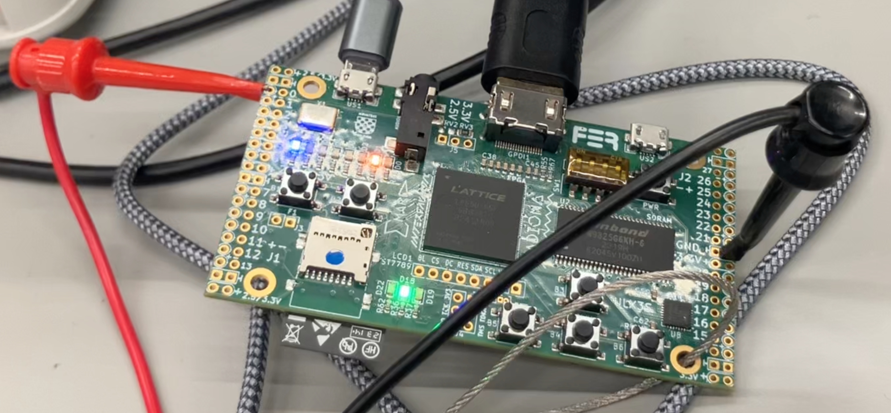

# Homework 5: Fully Pipelined Datapath

In this homework you will build on your design from HW4 and pipeline the entire datapath into 5 stages. There are two milestones for this assignment.

## Milestone 1: RV32I ALU Instructions and Branches

For this first milestone, you will need to handle the RV32I ALU instructions (except `auipc`) and also branch instructions. You can run this subset of the tests via the command:

```
RVTEST_ALUBR=1 pytest --exitfirst --capture=no testbench.py
```

You will need to implement MX and WX bypasses, and also a **WD bypass** so that if an instruction $i_d$ in Decode reads a register $x$ and another instruction $i_w$ in Writeback writes to $x$ in that same cycle, $i_d$ will receive its value of $x$ from $i_w$. You can implement this WD bypass inside your register file, or outside it in the Decode stage of the datapath, either is fine.

For this milestone, your datapath should always, by default, fetch the next sequential PC. Branch directions should be determined in Execute. On a taken branch, your datapath will flush the instructions in Fetch and Decode (replacing them with NOPs/bubbles) and then fetch the correct-path instruction in the following cycle (when the branch moves to the Memory stage). The pipelining lecture slides discuss the cycle timing in detail.

We recommend you work through the test cases in the order listed in `testbench.py`. The riscv-tests (except for `simple`) all exercise a variety of bypasses so you'll need all of that working before you can run them.

### Datapath trace outputs

To validate your pipelined design more fully, we have also introduced cycle-level test traces in this homework. Your datapath will need to set the `trace_*` output signals to identify, in each cycle, what is happening in the Writeback stage. See the documentation in `DatapathPipelined.sv` on these ports for details. We have provided cycle-by-cycle traces of the expected behavior of your processor in the `trace-*.json` files. The testbench will compare your processor's output against these traces for the LUI and BEQ riscv-tests (see `testTraceRvLui` and `testTraceRvBeq` in `testbench.py`). For the other riscv-tests we check only functional correctness, not cycle-level timing.


## Milestone 2: All RV32IM Instructions

For the second milestone, you will need to handle the rest of the RV32IM instructions. You can run this full set of tests via the command:

```
pytest --exitfirst --capture=no testbench.py
```

With the presence of load instructions comes the possibility of load-use dependencies, which must be handled via stalling. You should implement stalling in the Decode stage, i.e., if there is a load in Execute and a dependent instruction in Decode, in the next cycle the load should advance to Memory, the dependent instruction should remain in Decode, and Execute should be filled with a NOP.

You will also need to add WM bypassing to your pipeline.

### Divide/remainder operations

You will need to support divide and remainder operations - for simplicity we'll discuss only divide as remainder is handled identically. Your divide operations should use the pipelined divider from HW4. Since a divide takes 8 cycles, its quotient will not be available until much later than other ALU operations.

Divide operations should proceed to the M stage after they complete the divider pipeline. This keeps divides similar to other insns and allows for regular MX bypassing in cases like the one below where a (non-divide) consumer insn immediately follows a divide insn:
```
div x1,x2,x3 F D X0 X1 X2 X3 X4 X5 X6 X7 M W
addi x4,x1,0   F D  *  *  *  *  *  *  *  X M W
```

When the M stage is waiting for a divide insn to complete, the resulting stalls should have `CYCLE_DIV` status.

Your divide pipeline should also permit back-to-back execution of consecutive *independent* divide insns. If the first `div` insn enters Fetch in cycle 0, the code below will execute as follows:
```
div x1,x2,x3 F D X0 X1 X2 X3 X4 X5 X6 X7 M  W
div x4,x5,x6   F D  X0 X1 X2 X3 X4 X5 X6 X7 M W
```

For *dependent* divide insns, the younger insn must stall until the older insn completes the entire divide pipeline. The resulting stalls should also use status `CYCLE_DIV`.
```
div x1,x2,x3 F D X0 X1 X2 X3 X4 X5 X6 X7 M  W
div x4,x5,x1   F D  *  *  *  *  *  *  *  X0 X1 X2 X3 X4 X5 X6 X7 M W
```

Cycle-level tracing is also enabled for this milestone, this time for the LW and dhrystone tests.

## Memory

Due to pipelining, our memory now works slightly differently than it did in HW3/HW4. The HW5 memory uses the same clock as the datapath, and all memory reads/writes occur on the negative edge (half-way through the cycle).

## Disallowed SystemVerilog Operators

You cannot use the `/` or `%` operators in your code (except as part of compile-time code like `for` loops). Run `make codecheck` to see if any illegal operators are present; the autograder performs this same check.

## Implementation Tips

The pipelined design is substantially more complex than our previous designs. Our reference implementation is over 50% larger than the multi-cycle design. As signals multiply across the pipeline stages (e.g., you'll want to track the PC for each insn in each stage now), we recommend a strict naming convention (e.g., use the `f_` prefix for all Fetch signals, `d_` for all Decode signals, etc.) to make it easy to identify which signal corresponds to which stage.

SystemVerilog's `struct packed` are a great way to bundle your signals together and easily pass information from one stage to the next. Be sure to always assign these inside `always_ff` or `always_comb` blocks, however, to avoid combinational loops.

We have packaged up the RV disassembler into the `Disasm` module which is easier to work with. We recommend you instantiate one for each stage. The 32'd0 insn is also rendered as the string "bubble" now.

Instead of copying over all of your HW4 code at once and adding pipeline stages to it, we recommend you pull in just the parts needed to get each test case working. This will keep your design as small as possible as long as possible, making it easier to understand and debug.

The testcases we have provided are relatively limited. Adding your own tests will help you uncover bugs before they crop up in a larger riscv-test or dhrystone which are harder to understand. Alternatively, if you do discover a bug via a larger test, consider trying to reproduce the bug via a smaller test. This can make it easier to check your fix and to ensure that it stays fixed as you work on other parts of the design.

## Check timing closure

For this homework, you will again use the `resource-check` configuration to see how pipelining improves frequency.

## Submitting

Run `make demo-code resource-check` and then `make zip` and submit the `pipelined.zip` file on Gradescope. There is a resource leaderboard for this assignment, but it is strictly informational - no points are awarded based on the leaderboard results.

## HW5 Demo: Mystery Signal

After you have finished your 5-stage pipelined datapath, you can run the HW5 demo. In this demo, you will run a program on your processor that produces a mystery signal on one of the FPGA board's GPIO (General-Purpose Input/Output) pins.

Run `make demo-code` first to generate the assembly code running on your processor. And then run `make demo` to generate the bitstream and `make program` to program your design onto the FPGA. The FPGA must be running **before** you connect to the oscilloscope, otherwise there will be no signal for the oscilloscope to measure. The FPGA board will indicate the signal is being sent by flashing all the LEDs.

### FPGA Board Connections



Next, you will connect the oscilloscope to the FPGA board. Get a cable from the coat rack by the Africk Lab door (the one nearest the lobby), ensuring the cable has one red and one black lead on one end, and a black plug on the other end. Push on the red lead to extend the copper hook, and connect it to the leftmost (+) hole labeled `0` on the FPGA - this is GPIO positive pin 0. Connect the black lead to the rightmost `GND` hole on the right side of the board. This is your ground connection. When connected, it should look like the picture above.

### Oscilloscope Instructions


Now you are ready to use the oscilloscope. Follow these steps, which are also numbered in pink the picture above:

1. Connect the black plug from the oscilloscope cable to the oscilloscope's port 1. The plug must be aligned properly so that it can be inserted and then twisted clockwise into place - be sure not to force it!
2. Turn the oscilloscope on.
3. Press the `Auto Scale` button to have the oscilloscope automatically scale its output to match the voltages it senses from the FPGA board.
4. The `Run | Stop` button should be red, indicating the oscilloscope is stopped and not recording any signals. If the button is green, press it once to stop the oscilloscope.
5. Find the `Horizontal` knob.
6. Adjust the `Horizontal` knob until you see `200.0ms/` on the oscilloscope's screen, indicating that each horizontal grid cell represents 200 ms of time.
7. Press the `Run | Stop` button to start recording the signals. After a brief pause, you will see a yellow bar/waveform advance on the oscilloscope's screen from left to right. Once the bar reaches the right side of the screen, press `Run | Stop` again to end the recording. You can now use the `Horizontal` knob to zoom in on the signal. Use the `Navigate` section's triangle and square buttons to scroll left and right so that you can read the signal.

Once you are done with the demo, turn off the oscilloscope, gently disconnect the red and black leads from the board, and return the cable to the coat rack.

You will get credit for the demo just for viewing the mystery signal on the oscilloscope. If you manage to decode the mystery signal, however, tell a TA and they will be *extra* proud of you!!
