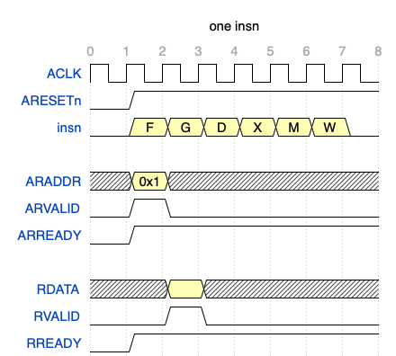
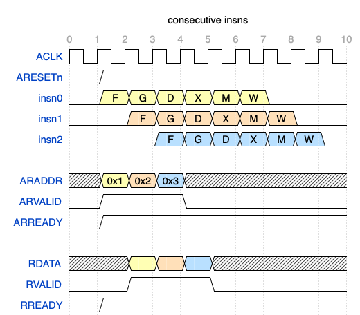
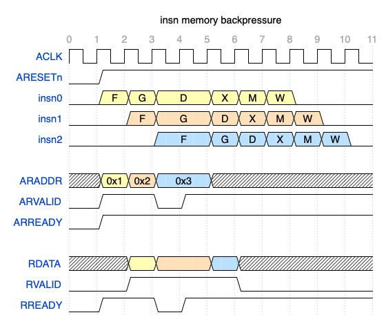
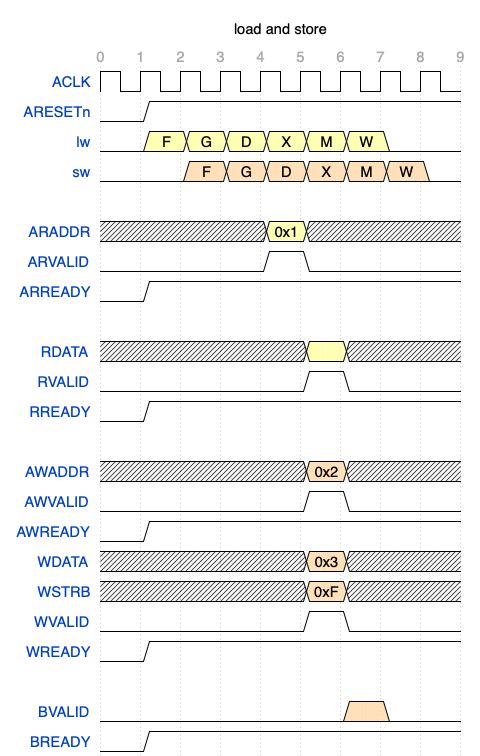

# Homework 6: Pipelined Datapath with AXI-Lite Memory

In this homework you will connect your pipelined datapath to a memory via the AXI4-Lite protocol ("AXIL" for short). There are several important simplifications/complications and tips below, so read through the whole document before beginning.

As in the previous homework, divide operations should proceed to the M stage after they complete the divider pipeline.

## Step 1: AXIL Insn Memory

First, you will replace the single-cycle memory with the EasyAxilMemory using the `port_ro` interface for the read-only interface to insn memory. The [official AXIL specification from ARM](https://www.arm.com/architecture/system-architectures/amba/amba-4) is a valuable and relatively accessible resource. Our designs, however, will have both simplifications and extensions which depart from the official AXIL specification, as noted below.

Because AXIL transactions occur only on the positive edge, insn memory access can no longer be hidden entirely within the Decode stage. Instead, your pipeline will need a new stage, which we call **G** (as in **G**oing to Insn Memory), to account for the 1-cycle latency of sending a read request to the memory on one rising edge and getting the response back on the next rising edge.

The waveforms below illustrate the required timing for a fetching a single insn: ([WaveDrom source](https://wavedrom.com/editor.html?%7Bsignal%3A%20%5B%0A%20%20%7Bname%3A%20%27ACLK%27%2C%20%20%20%20wave%3A%20%27p.......%27%7D%2C%0A%20%20%7Bname%3A%20%27ARESETn%27%2C%20wave%3A%20%2701......%27%7D%2C%0A%20%20%7Bname%3A%20%27insn%27%2Cwave%3A%20%2703333330%27%2C%20data%3A%20%5B%27F%27%2C%27G%27%2C%27D%27%2C%27X%27%2C%27M%27%2C%27W%27%5D%7D%2C%0A%20%20%7B%7D%2C%0A%20%20%7Bname%3A%20%27ARADDR%27%2C%20%20wave%3A%20%27x3x.....%27%2C%20data%3A%20%5B%270x1%27%2C%270x2%27%2C%270x3%27%5D%7D%2C%0A%20%20%7Bname%3A%20%27ARVALID%27%2C%20wave%3A%20%27010.....%27%7D%2C%0A%20%20%7Bname%3A%20%27ARREADY%27%2C%20wave%3A%20%2701......%27%7D%2C%0A%20%20%7B%7D%2C%0A%20%20%7Bname%3A%20%27RDATA%27%2C%20%20%20wave%3A%20%27x.3x....%27%7D%2C%0A%20%20%7Bname%3A%20%27RVALID%27%2C%20%20wave%3A%20%270.10....%27%7D%2C%0A%20%20%7Bname%3A%20%27RREADY%27%2C%20%20wave%3A%20%2701......%27%7D%2C%0A%5D%2C%0A%20%20head%3A%7B%0A%20%20%20text%3A%27one%20insn%27%2C%0A%20%20%20tick%3A0%2C%0A%20%7D%7D%0A))



As a result, you can't disassemble the Fetch instruction anymore, because there are no instruction bits in Fetch to disassemble - we only have a PC. You can examine the results of `RDATA` in G or D.

The addition of the G stage increases the branch misprediction penalty. Now, 3 insns much be flushed: from F, G and D.

To keep up with the datapath, our insn memory needs to be able to handle a new insn fetch every cycle. We would like to avoid inserting bubbles unless the pipeline needs to stall for some other reason (e.g., load-use hazard). While the official AXIL spec does not mandate particular timing from the subordinate or manager (this is the whole point of a latency-*insensitive* interface, after all!), our datapath has tighter timing constraints.

Here is the required timing for consecutive insn fetches: ([WaveDrom source](https://wavedrom.com/editor.html?%7Bsignal%3A%20%5B%0A%20%20%7Bname%3A%20%27ACLK%27%2C%20%20%20%20wave%3A%20%27p.........%27%7D%2C%0A%20%20%7Bname%3A%20%27ARESETn%27%2C%20wave%3A%20%2701........%27%7D%2C%0A%20%20%7Bname%3A%20%27insn0%27%2C%20%20%20wave%3A%20%2703333330..%27%2C%20data%3A%20%5B%27F%27%2C%27G%27%2C%27D%27%2C%27X%27%2C%27M%27%2C%27W%27%5D%7D%2C%0A%20%20%7Bname%3A%20%27insn1%27%2C%20%20%20wave%3A%20%270.4444440.%27%2C%20data%3A%20%5B%27F%27%2C%27G%27%2C%27D%27%2C%27X%27%2C%27M%27%2C%27W%27%5D%7D%2C%0A%20%20%7Bname%3A%20%27insn2%27%2C%20%20%20wave%3A%20%270..5555550%27%2C%20data%3A%20%5B%27F%27%2C%27G%27%2C%27D%27%2C%27X%27%2C%27M%27%2C%27W%27%5D%7D%2C%0A%20%20%7B%7D%2C%0A%20%20%7Bname%3A%20%27ARADDR%27%2C%20%20wave%3A%20%27x345x.....%27%2C%20data%3A%20%5B%270x1%27%2C%270x2%27%2C%270x3%27%5D%7D%2C%0A%20%20%7Bname%3A%20%27ARVALID%27%2C%20wave%3A%20%2701..0.....%27%7D%2C%0A%20%20%7Bname%3A%20%27ARREADY%27%2C%20wave%3A%20%2701........%27%7D%2C%0A%20%20%7B%7D%2C%0A%20%20%7Bname%3A%20%27RDATA%27%2C%20%20%20wave%3A%20%27x.345x....%27%7D%2C%0A%20%20%7Bname%3A%20%27RVALID%27%2C%20%20wave%3A%20%270.1..0....%27%7D%2C%0A%20%20%7Bname%3A%20%27RREADY%27%2C%20%20wave%3A%20%2701........%27%7D%2C%0A%5D%2C%0A%20%20head%3A%7B%0A%20%20%20text%3A%27consecutive%20insns%27%2C%0A%20%20%20tick%3A0%2C%0A%20%7D%7D%0A))



While integrating the insn memory, you can leave the data memory interface (`port_rw`) wires disconnected for simplicity, and run your datapath without talking to the data memory at all.

In addition to supporting pipeline stalls as usual, matching up the PC from an AXIL request to its response is subtle, as AXIL itself does not provide any connection between `ARDATA` and `RDATA`. Requests are processed in FIFO order but the manager must keep track.

Occasionally, you will need to send backpressure to the insn memory by lowering `RREADY`. E.g., when the datapath stalls it cannot accept new fetched insns, but a fetch request may already be in-flight. In the waveforms below, the yellow insn experiences a load-use dependency and needs to stall in D in cycle 3. This causes the orange insn following it to stall in G. Because the response from the insn memory is already present in cycle 3, we lower `RREADY` to cause the insn memory to retain the orange insn in `RDATA` for an extra cycle. As the blue insn remains in F for 2 cycles, we must also lower `ARVALID` in cycle 3 to avoid duplicating a request and fetching the blue insn twice. ([WaveDrom source](https://wavedrom.com/editor.html?%7Bsignal%3A%20%5B%0A%20%20%7Bname%3A%20%27ACLK%27%2C%20%20%20%20wave%3A%20%27p..........%27%7D%2C%0A%20%20%7Bname%3A%20%27ARESETn%27%2C%20wave%3A%20%2701.........%27%7D%2C%0A%20%20%7Bname%3A%20%27insn0%27%2C%20%20%20wave%3A%20%270333.3330..%27%2C%20data%3A%20%5B%27F%27%2C%27G%27%2C%27D%27%2C%27X%27%2C%27M%27%2C%27W%27%5D%7D%2C%0A%20%20%7Bname%3A%20%27insn1%27%2C%20%20%20wave%3A%20%270.44.44440.%27%2C%20data%3A%20%5B%27F%27%2C%27G%27%2C%27D%27%2C%27X%27%2C%27M%27%2C%27W%27%5D%7D%2C%0A%20%20%7Bname%3A%20%27insn2%27%2C%20%20%20wave%3A%20%270..5.555550%27%2C%20data%3A%20%5B%27F%27%2C%27G%27%2C%27D%27%2C%27X%27%2C%27M%27%2C%27W%27%5D%7D%2C%0A%20%20%7B%7D%2C%0A%20%20%7Bname%3A%20%27ARADDR%27%2C%20%20wave%3A%20%27x345.x.....%27%2C%20data%3A%20%5B%270x1%27%2C%270x2%27%2C%270x3%27%5D%7D%2C%0A%20%20%7Bname%3A%20%27ARVALID%27%2C%20wave%3A%20%2701.01......%27%7D%2C%0A%20%20%7Bname%3A%20%27ARREADY%27%2C%20wave%3A%20%2701.........%27%7D%2C%0A%20%20%7B%7D%2C%0A%20%20%7Bname%3A%20%27RDATA%27%2C%20%20%20wave%3A%20%27x.34.5x....%27%7D%2C%0A%20%20%7Bname%3A%20%27RVALID%27%2C%20%20wave%3A%20%270.1...0....%27%7D%2C%0A%20%20%7Bname%3A%20%27RREADY%27%2C%20%20wave%3A%20%2701.01......%27%7D%2C%0A%5D%2C%0A%20%20head%3A%7B%0A%20%20%20text%3A%27insn%20memory%20backpressure%27%2C%0A%20%20%20tick%3A0%2C%0A%20%7D%7D%0A))



Correctly implementing these changes requires a solid understanding of both AXIL signals and how your pipeline works. For all of these reasons, integrating the insn memory is significantly more challenging than integrating the data memory.

> Our AXIL memory is borrowed from [the ZipCPU project](https://zipcpu.com/blog/2020/03/08/easyaxil.html), which also has a nice article on the [skid buffers](https://zipcpu.com/blog/2019/05/22/skidbuffer.html) needed to achieve full throughput (1 transaction/cycle in steady state) in an AXIL subordinate.

### Simplifications from Official AXIL

You can make some simplifying assumptions compared to the regular AXIL protocol:

> The ARPROT, RRESP, AWPROT and BRESP signals can be ignored. Our memory never uses protection types or encounters any error conditions.


### Testing

To run the tests that require only the insn memory (the data memory can remain disconnected), use the following command:

```
RVTEST_ALUBR=1 pytest -xs testbench.py
```


## Step 2: AXIL Data Memory

As with the insn memory, using the AXIL data memory requires rearranging some code within your pipeline. The load/store address should be sent to the data memory at the end of the X stage. The memory access occurs during the M stage, and the result from memory (e.g., `RDATA` for loads) is registered at the end of the M stage and available for processing in the W stage. We illustrate the required timing below for the data memory (for simplicity, insn memory signals are not shown). ([WaveDrom source](https://wavedrom.com/editor.html?%7Bsignal%3A%20%5B%0A%20%20%7Bname%3A%20%27ACLK%27%2C%20%20%20%20wave%3A%20%27p........%27%7D%2C%0A%20%20%7Bname%3A%20%27ARESETn%27%2C%20wave%3A%20%2701.......%27%7D%2C%0A%20%20%7Bname%3A%20%27lw%27%2C%20%20%20%20%20%20wave%3A%20%2703333330.%27%2C%20data%3A%20%5B%27F%27%2C%27G%27%2C%27D%27%2C%27X%27%2C%27M%27%2C%27W%27%5D%7D%2C%0A%20%20%7Bname%3A%20%27sw%27%2C%20%20%20%20%20%20wave%3A%20%270.4444440%27%2C%20data%3A%20%5B%27F%27%2C%27G%27%2C%27D%27%2C%27X%27%2C%27M%27%2C%27W%27%5D%7D%2C%0A%20%20%7B%7D%2C%0A%20%20%7Bname%3A%20%27ARADDR%27%2C%20%20wave%3A%20%27x...3x...%27%2C%20data%3A%20%5B%270x1%27%2C%270x2%27%2C%270x3%27%5D%7D%2C%0A%20%20%7Bname%3A%20%27ARVALID%27%2C%20wave%3A%20%270...10...%27%7D%2C%0A%20%20%7Bname%3A%20%27ARREADY%27%2C%20wave%3A%20%2701.......%27%7D%2C%0A%20%20%7B%7D%2C%0A%20%20%7Bname%3A%20%27RDATA%27%2C%20%20%20wave%3A%20%27x....3x..%27%7D%2C%0A%20%20%7Bname%3A%20%27RVALID%27%2C%20%20wave%3A%20%270....10..%27%7D%2C%0A%20%20%7Bname%3A%20%27RREADY%27%2C%20%20wave%3A%20%2701.......%27%7D%2C%0A%20%20%7B%7D%2C%0A%20%20%7Bname%3A%20%27AWADDR%27%2C%20%20wave%3A%20%27x....4x..%27%2C%20data%3A%20%5B%270x2%27%2C%270xB%27%2C%270xC%27%5D%7D%2C%0A%20%20%7Bname%3A%20%27AWVALID%27%2C%20wave%3A%20%270....10..%27%7D%2C%0A%20%20%7Bname%3A%20%27AWREADY%27%2C%20wave%3A%20%2701.......%27%7D%2C%0A%20%20%7Bname%3A%20%27WDATA%27%2C%20%20%20wave%3A%20%27x....4x..%27%2C%20data%3A%20%5B%270x3%27%2C%270xE%27%2C%270xF%27%5D%7D%2C%0A%20%20%7Bname%3A%20%27WSTRB%27%2C%20%20%20wave%3A%20%27x....4x..%27%2C%20data%3A%20%5B%270xF%27%2C%270xF%27%2C%270xF%27%5D%7D%2C%0A%20%20%7Bname%3A%20%27WVALID%27%2C%20%20wave%3A%20%270....10..%27%7D%2C%0A%20%20%7Bname%3A%20%27WREADY%27%2C%20%20wave%3A%20%2701.......%27%7D%2C%0A%20%20%7B%7D%2C%0A%20%20%7Bname%3A%20%27BVALID%27%2C%20%20wave%3A%20%270.....40.%27%7D%2C%0A%20%20%7Bname%3A%20%27BREADY%27%2C%20%20wave%3A%20%2701.......%27%7D%2C%0A%5D%2C%0A%20%20head%3A%7B%0A%20%20%20text%3A%27load%20and%20store%27%2C%0A%20%20%20tick%3A0%2C%0A%20%7D%7D%0A))




Because stores are now sent to the data memory at the end of the X stage, there is no ability to leverage a WM bypass anymore, so you should remove that logic from your pipeline. The MX and WX bypasses remain important, however.

Similarly to the insn memory, the data memory also needs to be able to process a new transaction every cycle in case there are consecutive memory insns. The data memory has skid buffers to enable this.

The data memory integration is *much* simpler than the insn memory integration, because there are no stalls to contend with. Code must be moved out of the M stage, to either X or W, but not much else changes. Unfortunately, the insn memory integration must be completed first because the processor cannot run without an insn memory, while it can run non-memory insns without a data memory.

### Simplifications from Official AXIL

> You can assume that the data memory will always be ready (ARREADY, AWREADY, WREADY) to receive requests from your datapath.


### Testing

To run the full set of tests exercising both insn and data memory interfaces, run:

```
pytest -xs testbench.py
```

This is the same set of tests that the autograder will run.


## Tips

This assignment does not require writing much new code, but rather many small changes throughout your existing datapath. As a rough guide, for this assignment we added or changed about 700 lines of our HW5 processor. Most of the changes were moving large chunks of code around to support the data memory.

## Disallowed SystemVerilog Operators

You cannot use the `/` or `%` operators in your code (except as part of compile-time code like `for` loops). Run `make codecheck` to see if any illegal operators are present; the autograder performs this same check.

## Submitting

For HW6, run `make resource-check` and then `make zip` and submit the `axil.zip` file on Gradescope.

There is a resource leaderboard for HW6, but it is strictly informational - no points are awarded based on the leaderboard results.

## Demo: TBD
