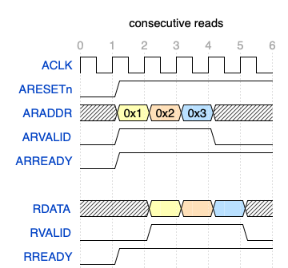
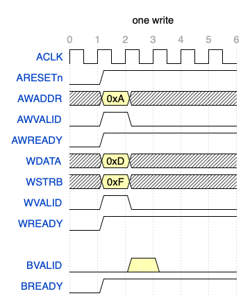
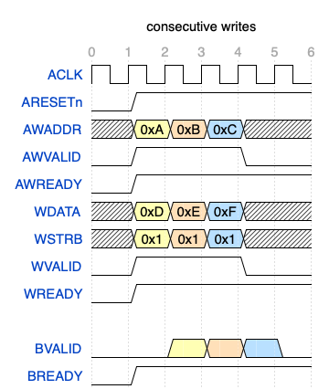
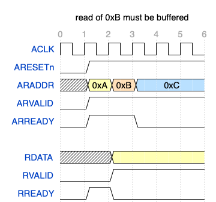

# Homework 6: Pipelined Datapath with AXI-Lite Cache

In this homework you will build a cache that communicates via the AXI4-Lite protocol ("AXIL" for short). You will then use that cache as both the I$ and D$ with your pipelined datapath from HW5. There are several important simplifications/complications and tips below, so read through the whole Milestone A section before beginning.

## Milestone A: AXIL Cache

First, you will need to build your AXIL cache, completing the starter code given in the `AxilCache` module in `AxilCache.sv`. The [official AXIL specification from ARM](https://www.arm.com/architecture/system-architectures/amba/amba-4) is a valuable and relatively accessible resource. Our designs, however, will have both simplifications and extensions which depart from the official AXIL specification, as noted below.

You will build a **direct-mapped writeback cache with 4B blocks**. While the `BLOCK_SIZE_BITS` parameter will always be 32 for our cache, the number of sets in your cache is adjustable via the `NUM_SETS` parameter. We will run tests on both a *small* version of your cache (16B capacity, to simplify debugging) and also a *big* version (2KB capacity, which is what your processor will use in HW6B).

You should begin with the cache hit tests, which live in `testbench_dmcache_hit.py`. 
```
pytest -xs -k runCocotbTestsDmCacheHitSmall testbench.py
```
These tests will initialize the cache with some data, and then request that data to exercise the hit logic in your cache, without the complexity of handling misses. We recommend you work through the test cases in the order provided, tackling reads first and then moving on to writes. These cache-hit tests will require your cache to act as an AXIL *subordinate*, responding to requests from an external *manager*.

Once these small-cache hit tests are working, you can try with a larger cache:
```
pytest -xs -k runCocotbTestsDmCacheHitBig testbench.py
```

You can run all the cache-hit tests like this (the `-k` flag matches string prefixes):
```
pytest -xs -k runCocotbTestsDmCacheHit testbench.py
```

### Cache Misses

Next, you should move on to handling cache misses in `testbench_dmcache_miss.py`. The testbench will connect your cache to an AXIL memory module implemented in Python (from [this nice AXI library for Cocotb](https://github.com/alexforencich/cocotbext-axi)). Your cache will forward miss requests to the  memory, which uses the AXIL protocol. When handling a miss, your cache will act as an AXIL *manager*, sending requests to the AXIL subordinate memory. You should start by handling read misses, and then move on to handling writes and writebacks.

To handle misses, your cache will need to implement a state machine. We have a recommended set of states to use in the `cache_state_t` enum. You are free to depart from this and rename, add or remove states as you see fit.

These miss tests can be run via:
```
pytest -xs -k runCocotbTestsDmCacheMissSmall testbench.py
pytest -xs -k runCocotbTestsDmCacheMissLarge testbench.py
```

The autograder will run all the cache tests via:
```
pytest -xs -k runCocotbTestsDmCache testbench.py
```

### Simplifications from Official AXIL

You can make some simplifying assumptions compared to the regular AXIL protocol:

> The ARPROT, RRESP, AWPROT and BRESP signals can be ignored. Our cache will never use protection types or encounter any error conditions.

> You can assume that AWADDR, WDATA and WSTRB always arrive in the same cycle. In regular AXIL, AWADDR may arrive before WDATA+WSTRB or vice-versa.

> You can assume that a read request and a write request will never arrive in the same cycle. In regular AXIL, the read and write interfaces are independent so, if both ARREADY and AWREADY then a read and a write could arrive simultaneously.

> When handling cache misses, you can assume that the memory will always be ready (ARREADY, AWREADY, WREADY) to receive requests from your cache.

### Complications over Official AXIL

To keep up with the datapath, our cache needs to be able to handle consecutive memory reads and writes: the datapath needs to be able to fetch a new insn each cycle, and a program may have consecutive load/store insns. We would like to avoid inserting bubbles in the common case of consecutive cache hits. While the official AXIL spec does not mandate particular timing from the subordinate or manager (this is the whole point of a latency-*insensitive* interface, after all!), we have tighter timing constraints. We illustrate the required timing in the diagrams below.

Timing for 1 read hit: [(source)](https://wavedrom.com/editor.html?%7Bsignal%3A%20%5B%0A%20%20%7Bname%3A%20%27ACLK%27%2C%20%20%20%20wave%3A%20%27p.....%27%7D%2C%0A%20%20%7Bname%3A%20%27ARESETn%27%2C%20wave%3A%20%2701....%27%7D%2C%0A%20%20%7Bname%3A%20%27ARADDR%27%2C%20%20wave%3A%20%27x3x...%27%2C%20data%3A%20%5B%270x1%27%2C%270x2%27%2C%270x3%27%5D%7D%2C%0A%20%20%7Bname%3A%20%27ARVALID%27%2C%20wave%3A%20%27010...%27%7D%2C%0A%20%20%7Bname%3A%20%27ARREADY%27%2C%20wave%3A%20%2701....%27%7D%2C%0A%20%20%7B%7D%2C%0A%20%20%7Bname%3A%20%27RDATA%27%2C%20%20%20wave%3A%20%27x.3x..%27%7D%2C%0A%20%20%7Bname%3A%20%27RVALID%27%2C%20%20wave%3A%20%270.10..%27%7D%2C%0A%20%20%7Bname%3A%20%27RREADY%27%2C%20%20wave%3A%20%2701....%27%7D%2C%0A%5D%2C%0A%20%20head%3A%7B%0A%20%20%20text%3A%27one%20read%27%2C%0A%20%20%20tick%3A0%2C%0A%20%7D%7D%0A)


Timing for consecutive read hits: [(source)](https://wavedrom.com/editor.html?%7Bsignal%3A%20%5B%0A%20%20%7Bname%3A%20%27ACLK%27%2C%20%20%20%20wave%3A%20%27p.....%27%7D%2C%0A%20%20%7Bname%3A%20%27ARESETn%27%2C%20wave%3A%20%2701....%27%7D%2C%0A%20%20%7Bname%3A%20%27ARADDR%27%2C%20%20wave%3A%20%27x345x.%27%2C%20data%3A%20%5B%270x1%27%2C%270x2%27%2C%270x3%27%5D%7D%2C%0A%20%20%7Bname%3A%20%27ARVALID%27%2C%20wave%3A%20%2701..0.%27%7D%2C%0A%20%20%7Bname%3A%20%27ARREADY%27%2C%20wave%3A%20%2701....%27%7D%2C%0A%20%20%7B%7D%2C%0A%20%20%7Bname%3A%20%27RDATA%27%2C%20%20%20wave%3A%20%27x.345x%27%7D%2C%0A%20%20%7Bname%3A%20%27RVALID%27%2C%20%20wave%3A%20%270.1..0%27%7D%2C%0A%20%20%7Bname%3A%20%27RREADY%27%2C%20%20wave%3A%20%2701....%27%7D%2C%0A%5D%2C%0A%20%20head%3A%7B%0A%20%20%20text%3A%27consecutive%20reads%27%2C%0A%20%20%20tick%3A0%2C%0A%20%7D%7D%0A)



Timing for 1 write hit: [(source)](https://wavedrom.com/editor.html?%7Bsignal%3A%20%5B%0A%20%20%7Bname%3A%20%27ACLK%27%2C%20%20%20%20wave%3A%20%27p.....%27%7D%2C%0A%20%20%7Bname%3A%20%27ARESETn%27%2C%20wave%3A%20%2701....%27%7D%2C%0A%20%20%7Bname%3A%20%27AWADDR%27%2C%20%20wave%3A%20%27x3x...%27%2C%20data%3A%20%5B%270xA%27%2C%270xB%27%2C%270xC%27%5D%7D%2C%0A%20%20%7Bname%3A%20%27AWVALID%27%2C%20wave%3A%20%27010...%27%7D%2C%0A%20%20%7Bname%3A%20%27AWREADY%27%2C%20wave%3A%20%2701....%27%7D%2C%0A%20%20%7Bname%3A%20%27WDATA%27%2C%20%20wave%3A%20%27x3x...%27%2C%20data%3A%20%5B%270xD%27%2C%270xE%27%2C%270xF%27%5D%7D%2C%0A%20%20%7Bname%3A%20%27WSTRB%27%2C%20%20wave%3A%20%27x3x...%27%2C%20data%3A%20%5B%270xF%27%2C%270xF%27%2C%270xF%27%5D%7D%2C%0A%20%20%7Bname%3A%20%27WVALID%27%2C%20wave%3A%20%27010...%27%7D%2C%0A%20%20%7Bname%3A%20%27WREADY%27%2C%20wave%3A%20%2701....%27%7D%2C%0A%20%20%7B%7D%2C%0A%20%20%7Bname%3A%20%27BVALID%27%2C%20%20wave%3A%20%270.30..%27%7D%2C%0A%20%20%7Bname%3A%20%27BREADY%27%2C%20%20wave%3A%20%2701....%27%7D%2C%0A%5D%2C%0A%20%20head%3A%7B%0A%20%20%20text%3A%27one%20write%27%2C%0A%20%20%20tick%3A0%2C%0A%20%7D%7D%0A)



Timing for consecutive write hits: [(source)](https://wavedrom.com/editor.html?%7Bsignal%3A%20%5B%0A%20%20%7Bname%3A%20%27ACLK%27%2C%20%20%20%20wave%3A%20%27p.....%27%7D%2C%0A%20%20%7Bname%3A%20%27ARESETn%27%2C%20wave%3A%20%2701....%27%7D%2C%0A%20%20%7Bname%3A%20%27AWADDR%27%2C%20%20wave%3A%20%27x345x.%27%2C%20data%3A%20%5B%270xA%27%2C%270xB%27%2C%270xC%27%5D%7D%2C%0A%20%20%7Bname%3A%20%27AWVALID%27%2C%20wave%3A%20%2701..0.%27%7D%2C%0A%20%20%7Bname%3A%20%27AWREADY%27%2C%20wave%3A%20%2701....%27%7D%2C%0A%20%20%7Bname%3A%20%27WDATA%27%2C%20%20%20wave%3A%20%27x345x.%27%2C%20data%3A%20%5B%270xD%27%2C%270xE%27%2C%270xF%27%5D%7D%2C%0A%20%20%7Bname%3A%20%27WSTRB%27%2C%20%20%20wave%3A%20%27x345x.%27%2C%20data%3A%20%5B%270x1%27%2C%270x1%27%2C%270x1%27%5D%7D%2C%0A%20%20%7Bname%3A%20%27WVALID%27%2C%20%20wave%3A%20%2701..0.%27%7D%2C%0A%20%20%7Bname%3A%20%27WREADY%27%2C%20%20wave%3A%20%2701....%27%7D%2C%0A%20%20%7B%7D%2C%0A%20%20%7Bname%3A%20%27BVALID%27%2C%20%20wave%3A%20%270.3450%27%7D%2C%0A%20%20%7Bname%3A%20%27BREADY%27%2C%20%20wave%3A%20%2701....%27%7D%2C%0A%5D%2C%0A%20%20head%3A%7B%0A%20%20%20text%3A%27consecutive%20writes%27%2C%0A%20%20%20tick%3A0%2C%0A%20%7D%7D%0A)



Buffering one request is required as the manager may not be initially ready to receive the response: [(source)](https://wavedrom.com/editor.html?%7Bsignal%3A%20%5B%0A%20%20%7Bname%3A%20%27ACLK%27%2C%20%20%20%20wave%3A%20%27p.....%27%7D%2C%0A%20%20%7Bname%3A%20%27ARESETn%27%2C%20wave%3A%20%2701....%27%7D%2C%0A%20%20%7Bname%3A%20%27ARADDR%27%2C%20%20wave%3A%20%27x345..%27%2C%20data%3A%20%5B%270xA%27%2C%270xB%27%2C%270xC%27%5D%7D%2C%0A%20%20%7Bname%3A%20%27ARVALID%27%2C%20wave%3A%20%2701....%27%7D%2C%0A%20%20%7Bname%3A%20%27ARREADY%27%2C%20wave%3A%20%2701.0..%27%7D%2C%0A%20%20%7B%7D%2C%0A%20%20%7Bname%3A%20%27RDATA%27%2C%20%20%20wave%3A%20%27x.3...%27%7D%2C%0A%20%20%7Bname%3A%20%27RVALID%27%2C%20%20wave%3A%20%270.1...%27%7D%2C%0A%20%20%7Bname%3A%20%27RREADY%27%2C%20%20wave%3A%20%27010...%27%7D%2C%0A%5D%2C%0A%20%20head%3A%7B%0A%20%20%20text%3A%27read%20of%200xB%20must%20be%20buffered%27%2C%0A%20%20%20tick%3A0%2C%0A%20%7D%7D%0A)



### Tips

The [cocotbext-axi library](https://github.com/alexforencich/cocotbext-axi) (pre-installed in your Docker container) has nice support for generating AXIL read/write requests and checking the responses, making it easy to interact with your cache in a couple lines of Python instead of having to manually set the AXIL signals directly. See the cache tests for examples.

We have provided a SV implementation of a simple AXIL memory in the `AxilMemory` module. You may find this helpful to consult while building your cache. When your design runs on the FPGAs for the HW6B demo, `AxilMemory` provides the memory that your caches connect to. `AxilMemory` has two AXIL interfaces, a read-only interface to support the I$ and a read-write interface for the D$. It has a 1-cycle response time and supports consecutive requests. We have simplified our implementation of `AxilMemory`, however, based on assumptions about how it is used with the datapath; see the code for more details.

The waveforms only record what is happening in SV code. During miss testing, when your cache is connected to a memory from the cocotbext-axi Python library, you cannot examine the memory's internal state in the waveforms. You can, however, read/write the memory via Python: see the tests for examples.

To give you a rough guide to the complexity of the cache, our reference cache implementation is about 250 lines of code.

## Milestone B: Datapath Integration

TBD


## Submitting

For HW6A, submit your `AxilCache.sv` file on Gradescope.

For HW6B, run `make resource-check` and then `make zip` and submit the `cache.zip` file on Gradescope.
